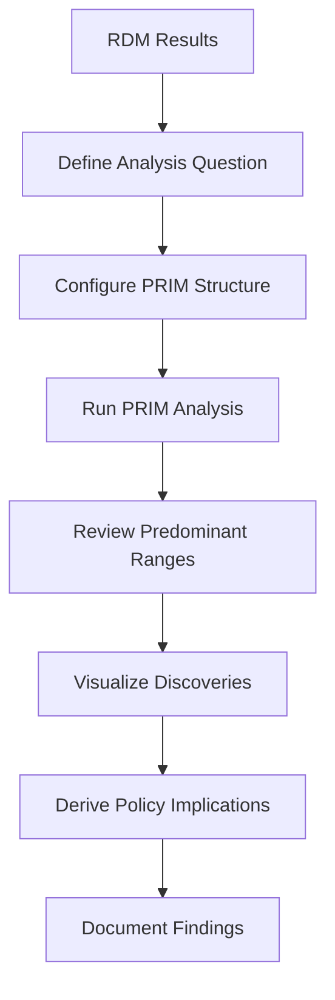

# Tutorial: Scenario Discovery with PRIM

This tutorial shows you how to use PRIM (Patient Rule Induction Method) to discover which parameter combinations lead to outcomes of interest.

## Prerequisites

- Completed the [Uncertainty Analysis Tutorial](uncertainty-analysis.md)
- RDM results available in `src/Results/`
- At least 50 futures for meaningful analysis

## What is Scenario Discovery?

Scenario discovery helps answer questions like:

- "Under what conditions do costs exceed the budget?"
- "What parameter combinations lead to high emissions?"
- "When does renewable energy dominate the mix?"

## Step 1: Define Your Analysis Question

### Example Questions

| Question | Outcome | Classification |
|----------|---------|----------------|
| High cost scenarios | TotalDiscountedCost | Above 90th percentile |
| Low emission scenarios | AnnualEmissions | Below 25th percentile |
| Renewable-dominated | RenewableShare | Above 50% |

For this tutorial, we'll identify: **"What conditions lead to costs exceeding 20% above baseline?"**

## Step 2: Configure PRIM Structure

Navigate to `src/workflow/4_PRIM/t3b_sdiscovery/Analysis_1/`

### Edit prim_structure.xlsx

#### Outcomes Sheet

Add your outcome:

| Column | Value |
|--------|-------|
| ID | 1 |
| Name | Total_System_Cost |
| Source | OSeMOSYS outputs |
| Set_Type | REGION |
| Sets | REG1 |
| Parameter | TotalDiscountedCost |
| Processing | cumulative |
| indicate_last_value | end |

#### Drivers Sheet

Add your drivers (match your uncertainties):

| ID | Name | Source | Set_Type | Parameter |
|----|------|--------|----------|-----------|
| 1 | Gas_Price | OSeMOSYS inputs | TECHNOLOGY | VariableCost |
| 2 | Solar_Cost | OSeMOSYS inputs | TECHNOLOGY | CapitalCost |
| 3 | Demand_Growth | OSeMOSYS inputs | FUEL | SpecifiedAnnualDemand |

## Step 3: Configure Analysis Periods

Edit `prim_files_creator_cntrl.xlsx`:

### periods Sheet

| period_list | year_initial | year_final |
|-------------|--------------|------------|
| all | 2020 | 2050 |
| near | 2020 | 2030 |
| mid | 2031 | 2040 |
| far | 2041 | 2050 |

### match_exp_ana Sheet

| exps | analyses | include_exp | include_ana |
|------|----------|-------------|-------------|
| 1_Experiment | 1 | YES | YES |

## Step 4: Configure PRIM_t3f2.yaml

Edit `src/workflow/4_PRIM/PRIM_t3f2.yaml`:

```yaml
# Base scenario name
BAU: 'Scenario1'

# Model names (must match Region from Interface_RDM.xlsx)
ose_inputs: 'OSeMOSYS-REG1 inputs'
ose_oupts: 'OSeMOSYS-REG1 outputs'

# Directory structure
dir_exps: '1_Experiment'
dir_sdisc: 't3b_sdiscovery'
Executables: 'Executables'
Experi_Plat: 'Experimental_Platform'
Futures: 'Futures'

# Processing parameters
max_per_batch: 10
```

## Step 5: Run PRIM Analysis

### Execute

```bash
python run.py prim
```

### Expected Output

```
======================================================================
📊 PRIM Pipeline (Patient Rule Induction Method)
======================================================================
Stages: prim_files_creator → prim_analysis
======================================================================

✓ RDM results found in src/Results/

🔄 Executing PRIM Pipeline...
----------------------------------------------------------------------
Step 1: Executing t3f1_prim_structure.py...
...
Step 2: Executing t3f2_prim_files_creator.py...
...
Executing t3f3_prim_manager.py...
...
Executing t3f4_range_finder_mapping.py...
----------------------------------------------------------------------
✅ PRIM Pipeline completed in 5m 32s!
```

## Step 6: Interpret Results

### Find Output Files

```bash
ls src/workflow/4_PRIM/t3b_sdiscovery/
```

Key files:
- `sd_ana_1_exp_1_Experiment.csv` - Raw analysis data
- `t3f4_predominant_ranges_a1_e1_Experiment.xlsx` - Discovered ranges

### Load Predominant Ranges

```python
import pandas as pd

# Load discoveries
ranges = pd.read_excel(
    'src/workflow/4_PRIM/t3b_sdiscovery/t3f4_predominant_ranges_a1_e1_Experiment.xlsx'
)

print(ranges.head(10))
```

### Understanding the Output

| Column | Meaning |
|--------|---------|
| Driver | Parameter that influences outcome |
| Low_Bound | Lower bound of the "box" |
| High_Bound | Upper bound of the "box" |
| Coverage | % of interesting cases captured |
| Density | % of cases in box that are interesting |

### Example Interpretation

```
Driver: Gas_Price
Low_Bound: 1.15
High_Bound: 1.50
Coverage: 0.82
Density: 0.71
```

**Meaning:** 
- When gas price multiplier is between 1.15 and 1.50
- This captures 82% of high-cost scenarios
- 71% of scenarios in this range are high-cost

## Step 7: Visualize Discoveries

### Box Visualization

```python
import matplotlib.pyplot as plt
import matplotlib.patches as patches

fig, ax = plt.subplots(figsize=(10, 8))

# Example: 2D visualization of PRIM box
# Gas price on x-axis, Solar cost on y-axis

# Plot all futures
ax.scatter(all_gas_prices, all_solar_costs, 
           c='lightblue', alpha=0.5, label='All scenarios')

# Highlight high-cost scenarios
ax.scatter(high_cost_gas, high_cost_solar,
           c='red', alpha=0.7, label='High-cost scenarios')

# Draw PRIM box
rect = patches.Rectangle(
    (1.15, 0.9),  # (x, y) lower-left corner
    0.35,          # width (1.50 - 1.15)
    0.3,           # height
    linewidth=2,
    edgecolor='green',
    facecolor='none',
    linestyle='--',
    label='PRIM box'
)
ax.add_patch(rect)

ax.set_xlabel('Gas Price Multiplier')
ax.set_ylabel('Solar Cost Multiplier')
ax.set_title('PRIM Scenario Discovery')
ax.legend()
plt.savefig('prim_box_visualization.png', dpi=150)
plt.show()
```

### Coverage-Density Trade-off

```python
# If multiple boxes are available
boxes = [
    {'coverage': 0.95, 'density': 0.50},
    {'coverage': 0.85, 'density': 0.65},
    {'coverage': 0.75, 'density': 0.75},
    {'coverage': 0.60, 'density': 0.85},
]

coverages = [b['coverage'] for b in boxes]
densities = [b['density'] for b in boxes]

plt.figure(figsize=(8, 6))
plt.plot(densities, coverages, 'bo-', markersize=10)
plt.xlabel('Density')
plt.ylabel('Coverage')
plt.title('PRIM Coverage-Density Trade-off')
plt.grid(True)

# Annotate points
for i, (d, c) in enumerate(zip(densities, coverages)):
    plt.annotate(f'Box {i+1}', (d, c), textcoords="offset points", 
                 xytext=(5,5), fontsize=9)

plt.savefig('coverage_density_tradeoff.png', dpi=150)
plt.show()
```

## Step 8: Policy Implications

### Translate Findings to Policy

From our example discovery:

**Finding:**
> High-cost scenarios occur when gas prices are 15-50% above baseline

**Policy Implications:**
1. **Hedge gas price risk**: Diversify fuel sources
2. **Accelerate renewables**: Reduce dependency on gas
3. **Demand management**: Reduce overall energy needs

### Create Summary Report

```python
summary = """
PRIM Scenario Discovery Summary
================================

Analysis Question:
What conditions lead to costs exceeding 20% above baseline?

Key Findings:

1. GAS PRICE (Primary Driver)
   - Critical range: 1.15x to 1.50x baseline
   - Coverage: 82% | Density: 71%
   - Interpretation: High gas prices are the main cost driver

2. SOLAR COST (Secondary Driver)
   - Critical range: 0.90x to 1.20x baseline
   - Coverage: 65% | Density: 60%
   - Interpretation: Slow solar cost reduction contributes to risk

3. COMBINED CONDITIONS
   - When both gas high AND solar slow
   - Coverage: 55% | Density: 85%
   - Interpretation: This combination almost guarantees high costs

Policy Recommendations:
- Implement gas price hedging mechanisms
- Accelerate solar deployment to reduce costs
- Consider demand-side management as insurance
"""

print(summary)
with open('prim_summary.txt', 'w') as f:
    f.write(summary)
```

## Advanced: Custom Outcome Thresholds

### Define Your Own Threshold

```python
# Load raw analysis data
analysis_data = pd.read_csv(
    'src/workflow/4_PRIM/t3b_sdiscovery/sd_ana_1_exp_1_Experiment.csv'
)

# Get baseline cost
baseline_cost = analysis_data[analysis_data['Future.ID'] == 0]['Total_System_Cost'].values[0]

# Define custom threshold: 20% above baseline
threshold = baseline_cost * 1.20

# Classify scenarios
analysis_data['High_Cost'] = analysis_data['Total_System_Cost'] > threshold

# Manual PRIM-like analysis
high_cost = analysis_data[analysis_data['High_Cost']]
low_cost = analysis_data[~analysis_data['High_Cost']]

print(f"Baseline cost: {baseline_cost:.2f}")
print(f"Threshold (20% above): {threshold:.2f}")
print(f"High-cost scenarios: {len(high_cost)} ({100*len(high_cost)/len(analysis_data):.1f}%)")
```

## Troubleshooting

### "No experiment data found"

Ensure RDM results exist:
```bash
ls src/Results/*.csv
```

### "Analysis returns empty boxes"

- Increase number of futures (need >50 for meaningful results)
- Check threshold definitions
- Verify driver-outcome relationships exist

### "Coverage is very low"

- The chosen threshold may be too extreme
- Try different percentile thresholds (75th instead of 90th)
- Add more driver parameters

## Next Steps

1. **Iterate on analysis**: Refine thresholds and drivers
2. **Multi-period analysis**: Compare findings across time periods
3. **Policy testing**: Use discoveries to design robust policies
4. **Stakeholder communication**: Visualize and present findings

## Complete Workflow Summary


